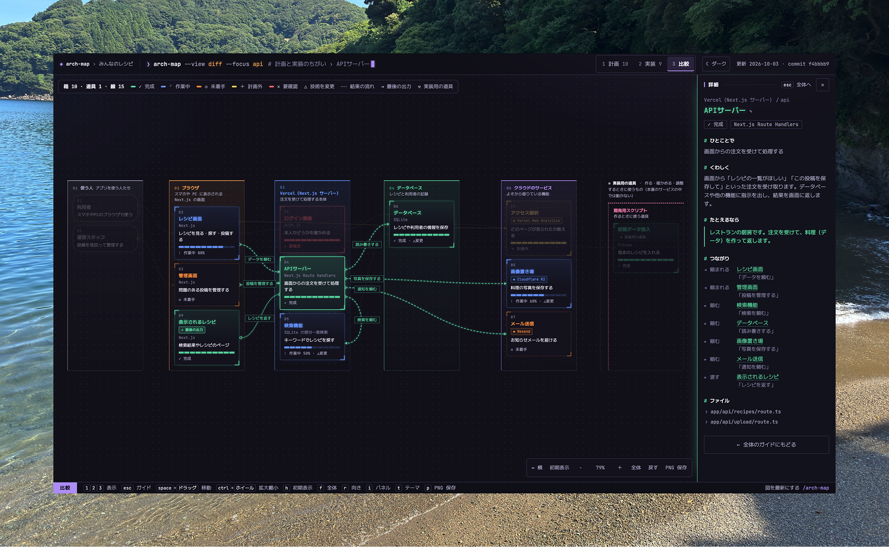

# arch-map

作っているアプリのアーキテクチャ（全体の構成）を、**初心者にもわかるクリックできる図**にする Claude Code / Codex スキルです。
プロジェクトでスキルを呼ぶと、コードと計画書を読み取って `docs/arch-map/index.html` を作ります。2 回目からは、前回から変わった部分だけを更新します。



- **計画・実装・比較**の 3 つの表示を切り替えられます（未着手・作業中・計画外・要確認がひと目でわかる）
- 箱をクリックすると、右のパネルに「ひとことで」「くわしく」「たとえるなら」「つながり」などの説明が出ます
- 決まった型（画面・サーバー・データ…）に当てはめず、**プロダクトで実際に分かれているまとまり**（動く場所・デプロイ単位など）で図を組みます
- コードから**事実に基づいて機能を拾い**、1 つの機能を 1 つの箱にして並べます。箱の数に上限はなく、機能を省きません
- 使っている外部サービス（API など）は、**サービス名・提供元・必要な環境変数の名前**まで明示します
- 図は**起きる順**に描きます。グループごとの列に、箱を起きる順に上から詰めて積み、箱の左上に順番の番号を出します（横長の画面では列が左から右、縦長の画面では帯が上から下に並ぶ。ボタン 1 つで切り替え）。箱が多い列は折り返すので、大きな図でもひと目で見渡せます。利用者の入力から、利用者が結果を受け取るところまで、途中を端折らずに描きます。同じ機能にもう一度戻るところは、箱を増やさず戻る矢印で描きます
- 本番のサービスの中で動く部品（組み込み）と、作る・確かめるための道具（実装用の道具）を分けて描きます
- キャンバスをドラッグで動かしたり、拡大縮小したりできます
- ダーク（CLI 風）とライト（ベージュのクラフト調）を切り替えられます
- 図全体を PNG 画像で保存できます

まず見た目を確かめたいときは、デモ（架空のレシピアプリ）を開いてください。

```bash
open demo/index.html
```

---

## 必要なもの

- [Claude Code](https://claude.com/claude-code) または [Codex](https://developers.openai.com/codex)
- Node.js 18 以上（仕上げの検証スクリプトで使います）
- 新しめのブラウザ（Chrome / Edge / Safari 16.4 以降 / Firefox 113 以降）

## インストール

リポジトリを手元に持ってきて、

```bash
git clone https://github.com/tomimoto5151/arch-map.git
cd arch-map
```

`skills/arch-map/` の中身を、使うツールの個人用スキルの置き場所にコピーします。

Claude Code:

```bash
mkdir -p ~/.claude/skills/arch-map && cp -R skills/arch-map/. ~/.claude/skills/arch-map/
```

Codex:

```bash
mkdir -p ~/.codex/skills/arch-map && cp -R skills/arch-map/. ~/.codex/skills/arch-map/
```

スキルを更新したとき（`git pull` したあとや、手直ししたあと）も、同じコマンドで上書きできます。
スキル一覧に `arch-map` が出れば準備完了です。出ないときは、使っているツールを再起動してください。

---

## 使い方

図を作りたいプロジェクトで、Claude Code なら `/arch-map`、Codex なら `$arch-map` と入力します。

| Claude Code | Codex | すること |
| --- | --- | --- |
| `/arch-map` | `$arch-map` | 計画と実装を自動で判断して、図を作る（すでにあれば更新する） |
| `/arch-map plan` | `$arch-map plan` | 計画（これから作るもの）だけを描く・直す |
| `/arch-map built` | `$arch-map built` | 実装（もう作ったもの）だけをコードから読み取る |

「アーキテクチャ図を作って」「構成図を更新して」のように普通の言葉で頼んでも動きます。

### 1 回目（新規作成）

1. エージェントがコードの構成（マニフェスト・ルーティング・DB スキーマ・`wrangler.toml` などの設定）と計画書（`PLAN.md`・`README.md`・会話で決めた計画など）を読みます
2. 画面の操作・メニュー・ショートカット・裏で動く処理などから、コードにある機能を拾い、1 つの機能につき 1 つの「箱」を作ります。どこで動くか・何がまとめてデプロイされるかから「枠（グループ）」を決めます。依存パッケージや `.env.example` のキー名から、使っている外部サービスも洗い出します
3. 箱ごとに、初心者向けの説明・たとえ・つながりを書きます
4. `docs/arch-map/` に 2 つのファイルができ、ブラウザで図が開きます

| ファイル | 役割 |
| --- | --- |
| `docs/arch-map/index.html` | 見た目（テンプレート）。手で編集しない |
| `docs/arch-map/arch-data.js` | 図の中身（JSON）。スキルが読み書きする |

サーバーは要りません。`index.html` をダブルクリックするか、次のコマンドで開けます。

```bash
open docs/arch-map/index.html
```

### 2 回目以降（更新）

コードや計画が変わったら、もう一度スキルを呼び出します。

- 前回記録した git の commit から何が変わったかだけを調べ、関係する箱と線だけを直します（全体を書き直さないので速くて軽い）
- 変わった内容は、右パネルのガイドにある「更新ログ」に残ります
- テンプレートが新しくなっていれば、`index.html` も自動で置き換わります

更新後は、開いているブラウザを再読み込みしてください。

---

## 図の見方

- **箱**: 機能。1 つの機能は 1 つの箱だけです。角の丸い箱は利用者など「人」です
- **線**: 「頼む側」から「頼まれる側」へ。矢印の先が頼まれる側です。箱を選ぶと、つながる線と「何を頼むか」のラベルが光ります
- **点線（白抜きの矢印）**: 結果が返っていく流れです。たどると、最後の出力に行き着きます
- **⇥ 最後の出力**: 利用者などが最後に受け取るもの（画面に出る結果、ターミナル出力、レポートなど）。そこから受け取る人へ点線がつながり、流れが人のところで閉じます。ガイドにも一覧が出ます
- **箱の左上の番号 = 機能が初めて動く順番**: 1 が最初の入力です。列の中は上から下へこの順に並びます。線は箱の辺の □ から出て、矢印の先が頼まれる側です。右から左への矢印は、前のまとまりにもう一度戻るところ（結果を返す・続きを頼む）で、同じ列の中どうしの線は右へふくらんで折り返します。横長の画面では横、縦長の画面では縦で開き、右下の「↔ 横／↕ 縦」か `r` キーで切り替えられます（選んだ向きは覚えておきます）
- **列（グループ）**: 横の流れでは縦の列、縦の流れでは横の帯。プロダクトで実際に分かれているまとまり（ブラウザ・Cloudflare Worker・判定パイプラインなど）で、呼び出しが進む向きに並びます
- **⚒ 実装用の道具**: 流れの後ろ（横の流れでは右端、縦の流れでは下）の区画。ビルドや評価スクリプトなど、作る・確かめるときに使うもので、本番のサービスの中では動きません（一点鎖線でつながります）
- **◈ サービス名**: 外部サービス（API など）を使っている箱。右のパネルにサービス名・提供元・公式ドキュメント・必要な環境変数の名前が出ます。ガイドには使っている外部サービスの一覧が出ます
- **進捗メーター**: 実装の進み具合の目安です

「比較」タブでの色と記号は次のとおりです。

| 表示 | 意味 |
| --- | --- |
| ✓ 完成 | 計画にあって、できあがっている |
| 作業中 | 計画にあって、作っている途中 |
| ◇ 未着手（点線） | 計画にあるけれど、まだ作っていない |
| ＋ 計画外（黄色） | 計画になかったけれど、実装で増えた |
| ✕ 要確認（赤） | テスト失敗など、気をつけるところがある |
| △変更 | 計画とは違う技術で作った |

## 操作

### マウス・トラックパッド

| 操作 | 動き |
| --- | --- |
| 箱をクリック | 右パネルに説明を表示（もう一度クリックか Esc で解除） |
| 右パネルの見出し（✎）をクリック | 名前を書き換え（「保存」で arch-data.js に書き戻す。[くわしく](#名前だけなら図の上で)） |
| 空いている所をドラッグ | キャンバスを移動 |
| スペース＋ドラッグ／中ボタンドラッグ | キャンバスを移動（箱の上からでも可） |
| ctrl（cmd）＋ホイール／ピンチ | カーソルの位置を中心に拡大・縮小 |
| 2 本指スクロール | キャンバスを移動 |

### キーボード

| キー | 動き |
| --- | --- |
| `1` `2` `3` | 計画・実装・比較を切り替え |
| `Esc` | 選択を外して、右パネルをガイドにもどす |
| `h` | 初期表示にもどす |
| `f` | 図全体が収まるように表示 |
| `r` | 図の向き（横・縦）を切り替え |
| `+` `-` `0` | 拡大・縮小・100% |
| `i` | 右パネルを開く・閉じる |
| `t` | ダーク・ライトの切り替え |
| `p` | PNG で保存 |

### 右下の操作パネル

`↔ 横／↕ 縦` `初期表示` `−` `100%` `＋` `全体` `全画面` `PNG 保存`

- **右パネル**: 「»」で閉じるとキャンバスを画面いっぱいに使えます。箱を選ぶと自動で開きます
- **PNG 保存**: 図全体を、プロジェクト名・凡例付きの画像（2 倍の解像度）で保存します。**見たまま**書き出すので、選択中の箱があると関係ない箱は薄く写ります。全体をきれいに出したいときは、Esc で選択を外してから保存してください
- **URL で共有**: URL の `#` 以降に表示と選択中の箱が入ります（例: `index.html#built/api`）。そのまま開くと同じ状態で表示されます

---

## データを手で直したいとき

### 名前だけなら図の上で

右パネルの見出し（箱の名前、ガイドではプロジェクト名）をクリックすると書き換えられます。Enter で決定、Esc でやめます。

書き換えると右パネルの上に「未保存」と出るので、「保存」を押して `docs/arch-map/arch-data.js` を選んでください。ファイルの中の名前の行だけが書き換わります。

- Chrome・Edge では、そのままファイルに書き戻します。初回だけファイルの選択と書き込みの許可を求められ、同じタブではそのあと押すだけで保存できます
- 違うプロジェクトのファイルや arch-map のデータでないファイルを選んだときは、書き込みません
- Safari・Firefox では、書き換えた `arch-data.js` がダウンロードされます。図と同じフォルダの `arch-data.js` をそれで置き換えてください
- 次にスキルで更新しても、書き換えた名前は引き継がれます

### それ以外は arch-data.js を直接

`docs/arch-map/arch-data.js` は JSON で書かれているので、手で直せます（コメントと末尾のカンマは不可）。
直したら、プロジェクトのルートで検証スクリプトを実行してください。書式の誤り・存在しない箱への線・秘密情報らしき文字列などをチェックし、整形して保存します。

```bash
node ~/.claude/skills/arch-map/scripts/archmap.mjs docs/arch-map  # Claude Code
node ~/.codex/skills/arch-map/scripts/archmap.mjs docs/arch-map   # Codex
```

使っているツールに合う行だけ実行してください。

- `✕` が出たら直すべき点です（このときファイルは書き換えません）
- `⚠` は表示はできるけれど、直したほうがよい点です（説明の抜け、長すぎる文など）

項目の一覧と書き方は [skills/arch-map/reference/schema.md](skills/arch-map/reference/schema.md) にあります。

---

## このリポジトリの構成

```
skills/arch-map/               スキル本体（各ツールの個人用スキルの置き場所にコピーして使う）
├── SKILL.md                   エージェントが読む手順書（新規作成・更新の流れと、書き方のルール）
├── reference/schema.md        arch-data.js の項目と書き方（新規作成のときだけ読む）
├── assets/viewer.html         図のテンプレート（index.html としてプロジェクトに置かれる）
├── assets/example-data.js     状態をひと通り含むデータの見本
└── scripts/archmap.mjs        仕上げのスクリプト（設置・検証・整形・日付と commit の記録）
demo/                          見本のデータで描いたデモ
```

### テンプレートを改修するとき

`skills/arch-map/assets/viewer.html` を直したら、先頭付近の次の番号を 1 つ上げてから、インストール先へコピーします。

```html
<meta name="arch-map-viewer" content="15">
```

各プロジェクトで次にスキルを呼び出したとき、番号が古い `index.html` は自動で新しいものに置き換わります。

---

## 注意点

- **秘密情報**: API キー・パスワード・`.env` の値は図に書かないルールです。検証スクリプトも、それらしい文字列を見つけると保存を止めます
- **オフライン**: 図はオフラインでも表示できます。フォント（JetBrains Mono・M PLUS 1 Code）だけは Google Fonts から読み込み、つながらないときは端末のフォントで表示します
- **テーマの記憶**: ダーク・ライトの選択はブラウザに記憶します。Safari の設定によっては file:// で開いたページで記憶できないことがあり、そのときは毎回 OS の設定に合わせて開きます
- **精度**: 図はエージェントがコードと計画書を読んで作る「目安」です。進み具合や要確認の根拠は、各箱の「実装メモ」に書かれます。テストを実際に動かして確かめたわけではないので、気になる点は右パネルの説明とファイルを見て確認してください

## ライセンス

[MIT](LICENSE)
